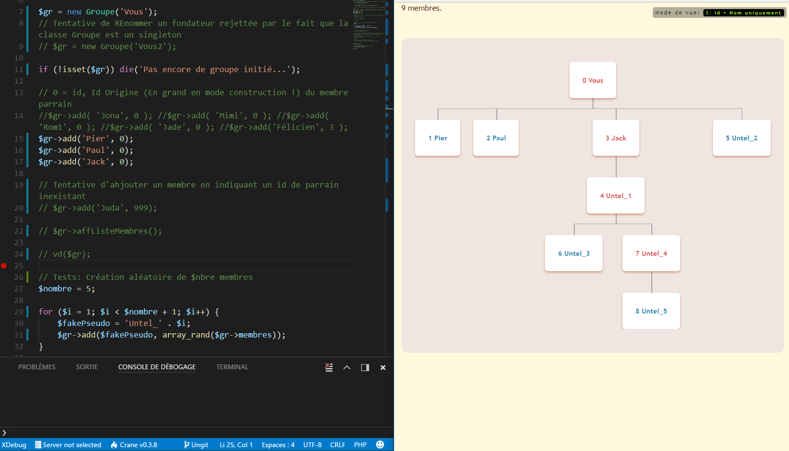

# [](http://www.cote7.com) Hierarchic Viewer*

## \*: V*ue*  H*iérarchique*

Nom de code: **VH**

Script de visualisation d'une structure hiérarchique gérée par le principe de la représentation intervallaire

- No Javascript - **Pure CSS** pour la **représentation graphique**
- No Librairie - No SQL - **PHP POO** pour le **traitement des données**

----

## Sommaire

- [Captures d'écran (***Screenshots***)](#captures-d%C3%A9cran-screenshots)
  - [VH](#vh)
  - [En action !](#en-action)
  - [Sass](#sass)
- [Contenu :](#contenu)
- [Installation](#installation)
  - [Récupération du projet, installation et lancement](#r%C3%A9cup%C3%A9ration-du-projet-installation-et-lancement)
- [Utilisation](#utilisation)
- [Developpement](#developpement)
- [Références & Sources](#r%C3%A9f%C3%A9rences-sources)

## Captures d'écran (***Screenshots***)

### VH



### En action !


### Sass


[Retour sommaire](#sommaire)

----

## Contenu :

- **Documentation en français** fournie (Nombreux commentaires dans le code)
- Usage du **préprocesseur Css SASS** (Sera purifié, nettoyé, fusionné avec vos autres éventuels fichiers de style, puis minifisé **automatiquement** avec l'exécuteur de tâches **GULP**)
- Gestion de l'arborescence selon le principe de la **Représentation Intervallaire** (Borne gauche, borne droite, profondeur,...)
- Rafraichissement **automatique** de votre navigateur (**gulp-browser-sync**) et optimisation des images (**gulp-imagemin**)
Couplé avec la fonction '**autosave**' de votre éditeur ou IDE préféré:

  **1 seule touche => Changement en live de votre page Web**

[Retour sommaire](#sommaire)

----

## Installation

### Récupération du projet, installation et lancement

Prérecquis: [NodeJS](https://nodejs.org/en)

Vérifiez votre version avec 

```ini
node -v
```

En console, dans le dossier de votre choix :

```ini
[ NB: Si vous souhaitez contribuer à ce projet, forkez d'abord ! ]
# Voir ci-dessous "Développement"

git clone https://github.com/grcote7/vh

npm install

gulp

```

[Retour sommaire](#sommaire)

----

## Utilisation

Pour 'dessiner' votre structure:

- Éditer le fichier **app/vhri.php** et modifier le code à volonté.
- Adapter votre style en modifiant **app/style.scss**
- Poser vos images dans **app/img** (Afin qu'elles soient optimisées automatiquement)

[Retour sommaire](#sommaire)

----

## Developpement

1. ***Fork*** le projet
2. Clôner VOTRE copie du projet

```ini
git clone URL_de_votre_dépôt_GitHub_de_VH
```

3. Réaliser toutes modifications, corrections, améliorations, etc... souhaitées

4. Demander une fusion (= Effectuer un ***Merge Request***)

NB: Outils conseillés: **[ungit](https://github.com/FredrikNoren/ungit)** (Intégré facilement dans les éditeurs Brackets ou Visual Studio Code grâce à leurs plugins respectifs) et **[GitKraken](https://www.gitkraken.com/)**

Penser à y ajouter ce dépôt, **VH** pour synchroniser facilement votre dépôt (***Add Remote*** et l'URL de ce dépôt)

[Retour sommaire](#sommaire)

----

## Références & Sources

- [Représentation Intervallaire (avec MySQL)](http://sqlpro.developpez.com/cours/arborescence/#L2) 
  
  Comprend d'excellentes illustrations aidant à une bonne compréhension du principe

- [Gestion d'arbres par représentation intervallaire](http://perso.univ-lemans.fr/~cpiau/BD/SQL_PAGES/SQL13.htm)

  Très bien expliqué et illustré, en permettant de mettre en place aisément quelques procédures stockées MySQL...

- [La Représentation Intervallaire](https://openclassrooms.com/courses/la-representation-intervallaire)

  Cours d'initiation rapide OpenClassRooms

- **[L'excellentissime article](https://laravel.sillo.org/cours-laravel-5-5-les-donnees-gerer-un-arbre)** de **BestMomo**

  Appliqué ici dans le cadre de la gestion des commentaires et éventuelles réponses en bas des posts d'un blog (Cas pratique dans une app réelle basée sur le framework LARAVEL)

[Retour sommaire](#sommaire)